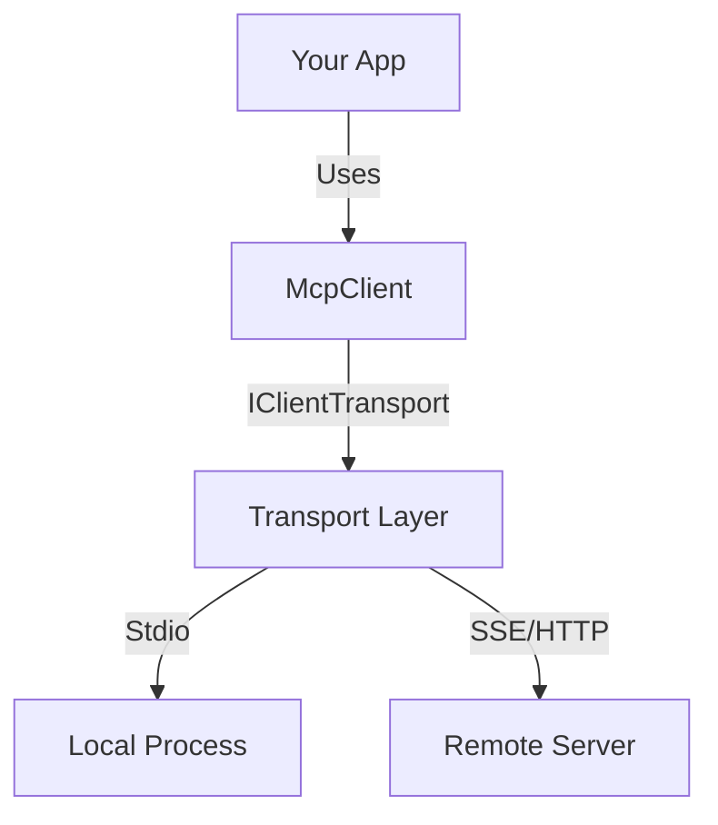

# Client Library Guide

> **New in v1.5.0**: A native .NET SDK for building robust Model Context Protocol (MCP) clients.

The **DotnetFastMCP Client Library** empowers .NET developers to easily connect to *any* MCP server (whether local or remote) and consume its tools, resources, and prompts. It abstracts away the JSON-RPC protocol details, providing a clean, type-safe C# API.

## 🚀 Key Features

*   **Transport Agnostic**: Seamlessly switch between local processes (Stdio) and remote servers (SSE) using the `IClientTransport` interface.
*   **Type-Safe Invocation**: Generic `CallToolAsync<T>` methods handling serialization/deserialization for you.
*   **Async Notifications**: Built-in support for receiving real-time logs and progress updates from tools.
*   **Zero-Dependency Core**: Lightweight and easily embeddable in any .NET 8 application.

## 📦 Architecture

The library is built around two main components:

1.  **`McpClient`**: The high-level orchestrator. It manages the message loop, matches responses to requests, and dispatches notifications.
2.  **`IClientTransport`**: The low-level connector.
    *   **`StdioClientTransport`**: Spawns a subprocess (e.g., `dotnet run MyServer.dll`, `python server.py`) and communicates via Standard Input/Output.
    *   **`SseClientTransport`**: Connects to an HTTP Server-Sent Events endpoint.



## 🛠️ Usage

### 1. Installation

Ensure your project references the `FastMCP` framework.

### 2. Connecting to a Local Server (Stdio)

This is ideal for AI Agents (like Claude Desktop) or tools that need to manage the server's lifecycle.

```csharp
using FastMCP.Client;
using FastMCP.Client.Transports;

// 1. Define the transport (e.g., calling a Python server)
var transport = new StdioClientTransport(
    command: "python", 
    arguments: "main.py"
);

// 2. Connect
await using var client = new McpClient(transport);
await client.ConnectAsync();

// 3. Use the client
var tools = await client.ListToolsAsync();
```

### 3. Connecting to a Remote Server (SSE)

Use this for distributed architectures where the MCP server runs independently.

```csharp
var transport = new SseClientTransport("http://localhost:5000/sse");
await using var client = new McpClient(transport);
await client.ConnectAsync();
```

### 4. Calling Tools

```csharp
// Simple call
var result = await client.CallToolAsync<int>("add_numbers", new { a = 10, b = 20 });
Console.WriteLine($"Result: {result}"); // Output: 30

// Call with specific result type
var weather = await client.CallToolAsync<WeatherResult>("get_weather", new { city = "Seattle" });
```

### 5. Handling Notifications

Subscribe to `OnNotification` to receive logs or progress updates pushed by the server.

```csharp
client.OnNotification += (method, payload) =>
{
    if (method == "notifications/message")
    {
        Console.WriteLine($"[LOG]: {payload}");
    }
};
```

## 🧪 Manual Verification & Demo

We have included a complete **Client Demo** project to help you test and verify the library.

### Prerequisites
*   The `BasicServer` example project must be built.

### Steps to Run

1.  **Build the Server**:
    ```powershell
    dotnet build -c Debug examples/BasicServer
    ```

2.  **Run the Demo**:
    ```powershell
    dotnet run --project examples/ClientDemo
    ```

### Expected Output

You should see the client connect, list tools, and successfully invoke the `add_numbers` tool:

```text
🚀 Starting MCP Client Demo...
🔌 Connecting to server at: ...\BasicServer.dll
✅ Connected!

--- Tools ---
 - add_numbers: Adds two integer numbers together.
 ...

--- Calling 'add_numbers' ---
Result: 10 + 55 = 65

--- Calling 'TestContext' (Wait for logs...) ---
[NOTIFY] notifications/message: ...
Context Result: Processed: Hello Client!
```

## 🔍 Troubleshooting

| Issue | Solution |
| :--- | :--- |
| **Method 'tools/call' not found** | Ensure your server SDK is updated to v1.5.0+. Older servers might only support legacy direct method calls. |
| **Process failed to start** | Check the path in `StdioClientTransport`. Absolute paths are recommended. |
| **Connection Refused (SSE)** | Ensure the server is running and the URL is correct (usually `/sse`). |
