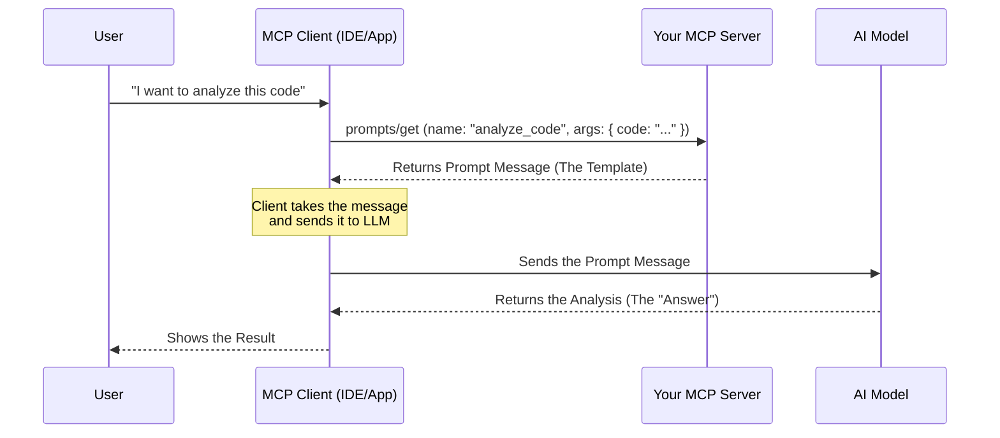

# Streamlining AI Interactions: Introducing First-Class Prompts in DotnetFastMCP

*A Guide to Building Reusable AI Templates with C# and DotnetFastMCP*

---

In the world of the **Model Context Protocol (MCP)**, **Prompts** are a powerful but often overlooked feature. They allow servers to expose reusable prompt templates that clients (like LLMs or IDEs) can use to interact with tools and resources effectively.

Today, we're excited to announce **first-class support for Prompts** in `DotnetFastMCP`. Just like Tools and Resources, Prompts can now be defined with simple C# attributes, handling all the protocol complexity for you.

## 🚀 Why Prompts Matter

Imagine you have a complex tool for analyzing code or generating unit tests. You *could* let the user figure out the best way to ask the LLM to use it. Or, you could provide a **Prompt**—a pre-defined template that ensures the LLM gets exactly the right context and instructions.

Prompts allow you to:
-   **Standardize Workflows**: Ensure every "Code Review" follows the same rigorous steps.
-   **Simplify User Input**: Ask the user for just a "function name" instead of writing a full paragraph.
-   **Reuse Context**: Bundle resources and instructions into a single, discoverable action.

## 🛠️ The "Fast" Way: Attribute-Based Prompts

In `DotnetFastMCP`, we believe in **zero-boilerplate**. You shouldn't have to write JSON parsers or manual switch statements to handle MCP requests.

With the new `[McpPrompt]` attribute, defining a prompt is as easy as writing a static method.

### Quick Start Example

Here is how you define a prompt that asks an LLM to analyze a piece of code:

```csharp
using FastMCP.Attributes;
using FastMCP.Protocol;

public static class EngineeringPrompts
{
    [McpPrompt("analyze_code")]
    public static GetPromptResult Analyze(string code, string language = "csharp")
    {
        return new GetPromptResult
        {
            Description = "Analyze code for bugs and style issues",
            Messages = new List<PromptMessage>
            {
                new PromptMessage 
                { 
                    Role = "user", 
                    Content = new 
                    { 
                        type = "text", 
                        text = $"Please analyze this {language} code:\n\n{code}" 
                    } 
                }
            }
        };
    }
}
```

**That's it.** The framework automatically:
1.  **Discovers** the method using reflection.
2.  **Exposes** it via `prompts/list` with the correct arguments (`code` as required, `language` as optional).
3.  **Binds** incoming JSON-RPC parameters to your C# arguments.
4.  **Invokes** the method when `prompts/get` is called.

## 🔄 The Architecture: How It Connects to LLMs

A common question is: *"Where does the LLM come in?"*

It's important to understand the separation of concerns in MCP:
1.  **Server (You)**: Provides the **Template** (the prompt). You do *not* run the LLM.
2.  **Client (e.g., Claude Desktop, Cursor)**: Requests the template from you, fills it with user data, and *then* sends it to the LLM.
3.  **LLM (e.g., Claude 3.5 Sonnet)**: Receives the filled prompt and generates the response.

### The Flow


So when your method returns `GetPromptResult`, you are constructing the **message** that the Client will ultimately send to the AI. You are defining the "Question", and the LLM provides the "Answer".

## 🔍 Deep Dive: How It Works

### 1. Discovery
When your server starts, `DotnetFastMCP` scans your assemblies for methods marked with `[McpPrompt]`. It creates the MCP schema automatically, inferring argument names, types, and required status from your C# method signature.

### 2. Parameter Binding
The framework uses the same powerful parameter binding engine as Tools. It supports:
-   **Primitive types** (int, string, bool)
-   **Complex objects** (automatically deserialized from JSON)
-   **Default values** (optional parameters)

### 3. The `GetPromptResult`
Your method simply returns a `GetPromptResult`. This object contains:
-   **Description**: A helpful summary for the user.
-   **Messages**: A list of messages (User or Assistant roles) that form the template. These messages are what the LLM will "see" when the prompt is activated.

## 💡 Real-World Use Case: Unit Test Generator

Let's build a prompt that helps users generate unit tests. It takes a description and requirements, and sets up the LLM to act as a senior QA engineer.

```csharp
[McpPrompt("generate_test")]
public static GetPromptResult GenerateTest(string functionName, string requirements)
{
    return new GetPromptResult
    {
        Description = "Generate xUnit tests for a function",
        Messages = new List<PromptMessage>
        {
            new PromptMessage 
            { 
                Role = "user", 
                Content = new 
                { 
                    type = "text", 
                    text = $"""
                    You are a Senior QA Engineer. Write a comprehensive xUnit test suite for:
                    
                    Function: {functionName}
                    Requirements:
                    {requirements}
                    
                    Include edge cases and use FluentAssertions.
                    """ 
                } 
            }
        }
    };
}
```

## 📦 Getting Started

This feature is available in the latest version of `DotnetFastMCP`.

1.  **Update** your `ServerComponents.cs` or create a new `Prompts` class.
2.  **Add** `using FastMCP.Attributes;` and `using FastMCP.Protocol;`.
3.  **Define** your prompts with `[McpPrompt]`.
4.  **Run!** Your prompts are instantly available to any MCP client.

---
*DotnetFastMCP is designed to make building MCP servers in .NET as fast and intuitive as possible. Star the repo to follow our progress!*
